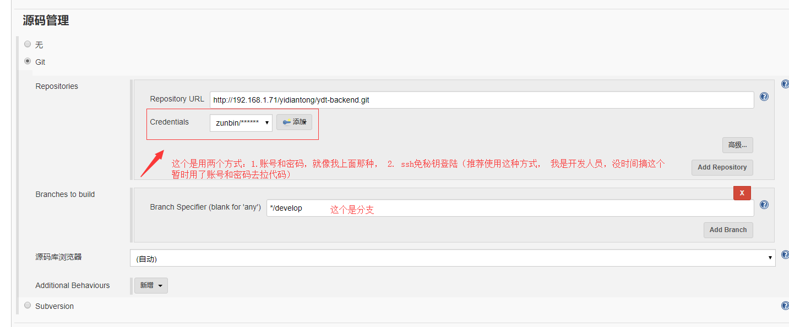
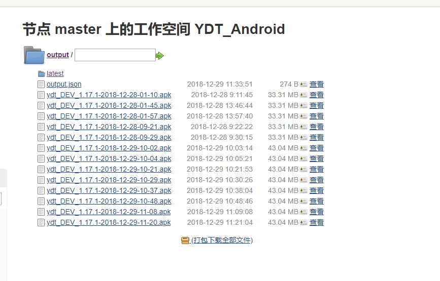

# Jenkins部署平台搭建
## 本项目主要是参照 [手把手指导搭建基于Docker+Jenkins+Git的集成发布环境视频课程](http://edu.51cto.com/center/course/lesson/index?id=202951)
## 环境准备
  >* 系统: centerOS 7.* 、Jenkins最新版本（2018.12.28）
  >* 
## U盘安装Linux安装
  >* 准备一个U盘（32g），centerOS7.*
  >* 用UltraISO制作系统 [制作系统链接](https://blog.csdn.net/sunxiaopengsun/article/details/77429568)  
  >* 系统选择， 不需要GUI， 电脑条件够的话建议安装GUI版本， 后面可以科学上网， 不然很麻烦
  
  >* 安装系统详细过程见[安装流程链接](https://blog.csdn.net/Jeffaryhe/article/details/75042971)
  >* 下面的第6步很重要， 一定要在前系统之前把网卡打开和设置iP、网关等等网络设置问题
  
  >* 下面的要注意的是在安装系统之前把root密码和普通用户设置好（为了安全操作，这里建议所有在普通用户操作， 不建议在root用户操作）
  

     > 附件里面也有系统
     > 国内镜像下载地址（阿里）： [CenterOS7国内镜像链接](https://opsx.alibaba.com/mirror) 
## 安装Jenkins（不建议在docker上面安装Jenkins， 目前bug听过挺多，建议在宿主机上面安装）
  >* 在安装之前准备一下环境， OPENJDK， MAVEN仓库， gradle，git，svn， NodeJS（这个是打包vue.js）
  >* 我用Tomcar+war包，一直不成功，后台改成yum来安装， [这个是安装Jenkins的教程，不需要看其他内容（链接）](https://www.cnblogs.com/rslai/p/8135460.html)
  >* [不行的话，再看安装Jenkins教程链接](https://www.jianshu.com/p/c517f09df025)
  

`MAVEN_HOME=/usr/local/maven3 

JAVA_HOME=/usr/lib/jvm/java-1.8.0-openjdk-1.8.0.191.b12-1.el7_6.x86_64

JRE_HOME=/usr/lib/jvm/java-1.8.0-openjdk-1.8.0.191.b12-1.el7_6.x86_64/jre

GRADLE_HOME=/usr/local/gradle/gradle-5.0

ANDROID_HOME=/usr/local/android-tools

export MAVEN_HOME

export GRADLE_HOME

export JAVA_HOME

export JRE_HOME

export ANDROID_HOME

export PATH=${PATH}:${MAVEN_HOME}/bin:${GRADLE_HOME}/bin:${JAVA_HOME}/bin:${JRE_HOME}/bin:${ANDROID_HOME}/tools:
${ANDROID_HOME}/tools/bin

`
  >* [MAVEN配置路径](https://www.jianshu.com/p/60fb231a160e)
  >* 下面全部是Jenkins用到的环境（全局工具配置）

 >* Linux的Android配置sdk环境有点麻烦， 不像在window系统比较简单，网上有教程
 >* [配置JDK环境链接](https://blog.csdn.net/youzhouliu/article/details/51183115)
 >* [这个是查找JDK路径链接](https://blog.csdn.net/u011943953/article/details/78019317)
## 安装git，并配置SSH
 >* [安装git链接](http://www.cnblogs.com/rslai/p/8175864.html)
 >* [配置git的ssh登陆](http://www.cnblogs.com/rslai/p/7840515.html)
## 远程SSH免密登陆配置
 >* 由于Jenkins和docker服务器不在同个服务器,需要配置免密登陆
 >* [Jenkins的系统设置里配置教程](http://www.cnblogs.com/wangqianqiannb/p/7200791.html?utm_source=itdadao&utm_medium=referral)
 >* [Jenkins的系统设置里配置教程2](https://blog.csdn.net/u010947098/article/details/61922969)
 >* [Jenkins的系统设置里配置教程和项目里面配置，我下面会讲](https://blog.csdn.net/tototuzuoquan/article/details/78568655)
## 后台配置篇（Java后台,docker怎么搭建， 自己上网查找）

		> 1.由于java后台构建配置比较容易，所以放在第一
		> 2.Vue.js， 我不是很熟悉构建环境，难度系数比java后台难点
		> 3.Android篇超级麻烦，细节超级多
 >* 整体流程： 首先配置maven -> 项目变量设置 -> 配置仓库（强烈推荐git代码管理）-> 远程调用另外一台服务器的shell脚本（deloy.sh， 记得权限chmod）生成server和dockerfile文件，顺便把war包上传到这台服务器上
 >* 下面是相关的配置

 

[Maven单独构建多模块项目中的单个模块链接](https://www.cnblogs.com/EasonJim/p/8350560.html)

[国外这边文章构建多模块项目中的单个模块链接](https://blog.sonatype.com/2009/10/maven-tips-and-tricks-advanced-reactor-options/#.VpdK9Nwaa6M)

	详解：
    > shell脚本在附件里面
    > clean install -pl xzn-admin -am -Pdev -D maven.test.skip=true
    > /root/data/dockerfiles/scripts/deloy.sh $project_name $project_name $GIT_BRANCH 8802 6006 8816
    > xzn-admin/target/*.war
    > xzn-admin/target/
    > /war/$project_name
	

## 前端篇（针对vue.js打包）
	
	参照以下链接： 
[jenkins自动化部署vue链接](https://blog.csdn.net/jonsonler/article/details/81317352)

[实战笔记：Jenkins打造强大的前端自动化工作流链接](https://juejin.im/post/5ad1980e6fb9a028c42ea1be)

	详解： 
	> echo $PATH
	> node -v
	> npm -v
	> FILE=${WORKSPACE}/jabAdmin/src/router/index.js
	> #NEWCON="\/\/"
	> YDT_DOMAIN_DEV='window.domain = "http://192.168.1.180:8802"'
	> echo "change env to dev start"
	> #sed -i "50c${NEWCON}" $FILE 
	> #sed -i "51c${NEWCON}" $FILE 
	> #sed -i "52c${NEWCON}" $FILE 
	> #sed -i "53c${NEWCON}" $FILE 
	> #sed -i "54c${NEWCON}" $FILE 
	> #sed -i "55c${ADDRESS}" $FILE 
	> #sed -i 's@^window.domain = .*@${ADDRESS}@g' $FILE 
	> #sed -i "s@^window.domain = .*@$ADDRESS@g" $FILE 
	> sed -i "s@^window.domain = .*@$YDT_DOMAIN_DEV@g" $FILE
	> echo "change env to dev end"
	> cd jabAdmin 
	> npm install chromedriver --chromedriver_cdnurl=http://cdn.npm.taobao.org/dist/chromedriver
	> npm install
	> rm -rf dist
	> npm run build
	> cd dist
	> tar -zcvf ${static_package} *
	> cd ../
	> pwd

	> jabAdmin/dist/${static_package}
	> jabAdmin/dist
	> /static/$project_name
	> /root/data/dockerfiles/scripts/deloyForVUE.sh $project_name $project_name $GIT_BRANCH 8082 8802 $static_package

## Android篇 (整体流程： [Android Jenkins集成（自动化打包）](https://www.jianshu.com/p/339fdeb6c72e))
####准备环境

	fir-plugin（可选，fir平台上传二维码时, 蒲公英去它平台上找）
	Subversion Release Manager plugin(可选)
	Subversion Plug-in(可选)
	Git plugin
	Gradle Plugin
	Email Extension Plugin
	description setter plugin
	build-name-setter
	user build vars plugin
	Post-Build Script Plug-in
	Branch API Plugin
	SSH plugin
	Scriptler
	Dynamic Parameter Plug-in 此插件存在Bug，后面详细说
	Git Parameter Plug-In配置

####整体流程

	详解：
	>APP_VER_CODE 22 23
	>APP_STG DEV TEST PRO
	>APP_VER_NAME 1.17.1 1.18.0
	>#${BUILD_NUMBER}_${APP_VER_CODE}_${APP_STG}_${APP_VER_NAME}    插件：build-name-setter， 效果如下：

	>执行shell（构建前， 切换环境和版本号）： bash ${WORKSPACE}/scripts/build.sh  ${APP_VER_CODE}  ${APP_VER_NAME} ${WORKSPACE} ${APP_STG}
	>app:clean app:assembleDebug
	>打包完成执行shell脚本： ${WORKSPACE}/scripts/saveApk.sh 插件： Post-Build Script Plug-in 	下面这张图是效果图

	>集成蒲公英：
	
[使用 Jenkins 插件上传应用到蒲公英链接](https://www.pgyer.com/doc/view/jenkins_plugin)（推荐使用插件，命令行也可以） 

[蒲公英返回参数链接](https://www.pgyer.com/doc/api#uploadApp)

[Jenkins + 蒲公英 自动发布两个小技巧链接](https://jaycechant.info/2017/two-tips-for-jenkins-pgyer/)

	>set build description： description setter plugin图

	相关链接如下：

[使用Jenkins进行Android自动打包，自定义版本号等信息链接](https://juejin.im/entry/5adaa9ecf265da0ba062b9a1) 

[mabeijianxi/android-automation链接（github）](https://github.com/mabeijianxi/android-automation)

##邮箱通知（史上最坑的环节，我用163邮箱的SMTP服务不行， 后来用了QQ的SMTP就ok）
  	
	Jenkins的邮箱通知分为Jenkins内置和插件， 内置的不好， 只有在失败的时候才发邮件， 定制化的采用插件
	一定看这个链接下面的这个链接： 
[Jenkins发送测试报告邮件链接](https://blog.csdn.net/galen2016/article/details/77975965)
	
	第一步： 去到系统设置里面：

	第二步： 去到项目设置里面：

	
	详解： 
	smtp.qq.com
	@qq.com
	905192187@qq.com 
	905192187@qq.com wangzb@cnjnb.com
	905192187@qq.com wangzb@cnjnb.com
	$DEFAULT_REPLYTO
	$DEFAULT_PRESEND_SCRIPT
	$DEFAULT_POSTSEND_SCRIPT
	905192187@qq.com
	$DEFAULT_REPLYTO

	$PROJECT_NAME-Build # $BUILD_NUMBER - $BUILD_STATUS!

	(邮件由Jenkins自动发出，请勿回复~)  
	项目名称：$PROJECT_NAME  
	构建编号：$BUILD_NUMBER  
	构建状态：$BUILD_STATUS  
	触发原因：${CAUSE}  
	构建地址： <A HREF="${BUILD_URL}">${BUILD_URL}</A>  
	二维码地址:   
	<a  HREF="${appQRCodeURL}">${appQRCodeURL}</a>  
	二维码： 
	 
	构建输出日志：   
	<a href="http://192.168.1.49:8080/job/${PROJECT_NAME}/${BUILD_NUMBER}/console">http://192.168.1.49:8080/${PROJECT_NAME}/${BUILD_NUMBER}/console</a> 
	
	效果图如下：

	总结：
	我收到的邮箱内容是空的， 我在Always里面没有设置内容， 所以才是空的

##使用Generic Webhook Trigger插件实现Jenkins+WebHooks（gitlab）持续集成

	推荐看下面的链接配置：

[Jenkins和Git实现自动构建部署链接](https://juejin.im/entry/5a22a2c46fb9a0451d414918)

	另外参照了别的链接如下：

[使用Generic Webhook Trigger插件实现Jenkins+WebHooks（码云）持续集成链接](https://blog.csdn.net/xlgen157387/article/details/72852428hook)

[使用Generic Webhook Trigger插件实现Jenkins+WebHooks（码云）持续集](https://blog.csdn.net/xlgen157387/article/details/72852428)

	

	详解：
	ref
	$.ref
	project.git_ssh_url
	$.project.git_ssh_url
	^(refs/heads/develop)_(git@gitlab.jnb.com:yidiantong/ydt-backend.git)$
	$ref_$project.git_ssh_url
	^(refs/heads/develop)_(git@gitlab.jnb.com:yidiantong/ydt-backend.git)$
	$ref_$project.git_ssh_url
	http://<User ID>:<API Token>@<Jenkins IP地址>:端口/generic-webhook-trigger/invoke 
	上面的token是在

##视图管理

	参考链接如下：

[Jenkins创建视图和编辑视图](https://www.jianshu.com/p/717dd02a59b6)

	效果图如下：
